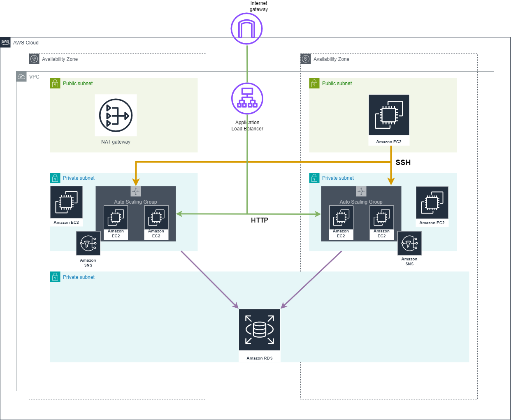

# TerragruntModules
Repository contains the terraform modules for terragrount-projects use. 

The picture below shows an example of "3 tier" architecture created using following modules from this repository:
* [Virtual Private Cloud VPC](vpc/README.md)
* [Relational Database Service (RDS)](rds-db/README.md)
* [Bastion Host (EC2)](ec2-bastion/README.md)
* [Private EC2 instances](ec2-private/README.md)
* [Auto Scaling Groups (ASG)](asg/README.md)
* [Application Load Balancer (ALB)](alb/README.md)

