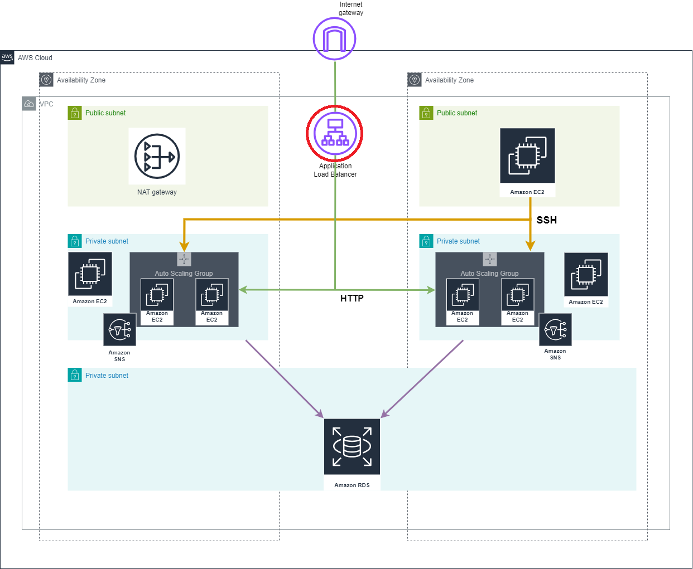

# Application Load Balancer (ALB)

## Resources used in this module

### AWS ALB 

Elastic Load Balancing automatically distributes your incoming traffic across multiple targets, such as EC2 instances, containers, and IP addresses, in one or more Availability Zones. It monitors the health of its registered targets, and routes traffic only to the healthy targets. Elastic Load Balancing scales your load balancer as your incoming traffic changes over time. It can automatically scale to the vast majority of workloads.

### AWS ALB Listeners

A listener checks for connection requests from clients, using the protocol and port that you configure. The rules that you define for a listener determine how the load balancer routes requests to its registered targets. Each rule consists of a priority, one or more actions, and one or more conditions. When the conditions for a rule are met, then its actions are performed.

### AWS LB Target Groups

Each target group routes requests to one or more registered targets, such as EC2 instances, using the protocol and port number that you specify. You can register a target with multiple target groups.

## Inputs required for this module to start

- vpc_id - Id of VPC
- asg_id - Id of autoscaling group
- ec2_instaces - EC2 private instances ids
- ec2_private_sg_ids - EC2 private sg id
- public_subnet_ids - Public subnets ids

## Outputs generated after building all resources

- alb_id - The ID and ARN of the load balancer we created
- alb_arn - The ID and ARN of the load balancer we created

