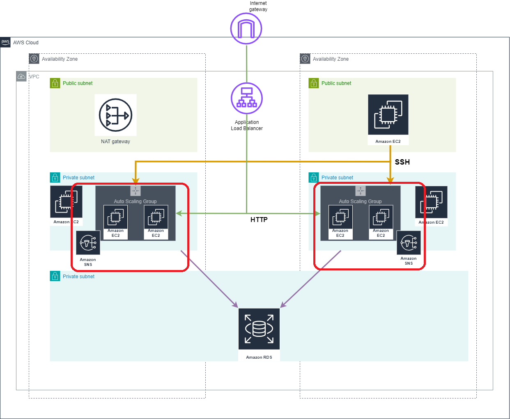

# Auto Scaling groups (ASG)

## Resources used in this module

### AWS ASG 

An Auto Scaling group contains a collection of EC2 instances that are treated as a logical grouping for the purposes of automatic scaling and management. An Auto Scaling group also lets you use Amazon EC2 Auto Scaling features such as health check replacements and scaling policies.

### AWS ASG Schedule

Scaling by schedule means that scaling actions are performed automatically as a function of date and time. This is useful when you know exactly when to increase or decrease the number of instances in your group, simply because the need arises on a predictable schedule.

### AWS ASG Policy

A more advanced way to scale your resources, using dynamic scaling, lets you define a scaling policy that dynamically resizes your Auto Scaling group to meet changes in demand.

### Launch template

 The launch template specifies information such as the AMI ID, instance type, key pair, security groups, and block device mapping for your instances.

### AWS SNS

Amazon SNS notify you when your Auto Scaling group launches or terminates instances. You can only turn Amazon SNS notifications on or off.

## Inputs required for this module to start

- instance_type - EC2 instance type
- private_subnet_ids - IDs of private subnets
- instance_keypair - AWS EC2 Key pair that need to be associated with EC2 Instance
- ec2_private_sg_ids - EC2 private sg id

## Outputs generated after building all resources

- launch_template_id - Launch Template ID
- launch_template_latest_version - Launch Template Latest Version
- autoscaling_group_id - Autoscaling Group ID
- autoscaling_group_name - Autoscaling Group Name
- autoscaling_group_arn - Autoscaling Group ARN