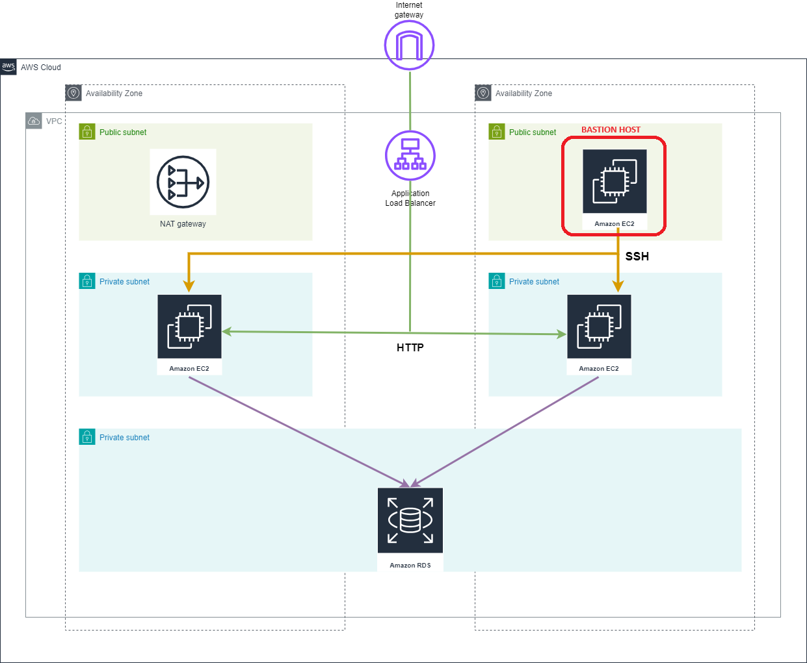

# Amazon Elastic Compute Cloud (EC2)

## Resources used in this module

### EC2 instance

Amazon Elastic Compute Cloud (Amazon EC2) is a web service that provides secure, resizable compute capacity in the cloud. Bastion EC2 instance is placed in public subnet. EC2 bastion host give you access to any private instance throug SSH port. 

### Security group

Provides a security group resource for EC2 insatnce. 

## Inputs required for this module to start

- env - Environment name
- instance_type - EC2 instance type
- ec2_bastion_subnet_id - EC2-bastion subnet id
- vpc_id - Id of VPC
- instance_keypair - AWS EC2 Key pair that need to be associated with EC2 Instance

## Outputs generated after building all resources

- ec2_public_instance_id - ID of instance
- ec2_public_ip - Public IP address assigned to the instance
- ec2_public_sg_ids - EC2 public sg id