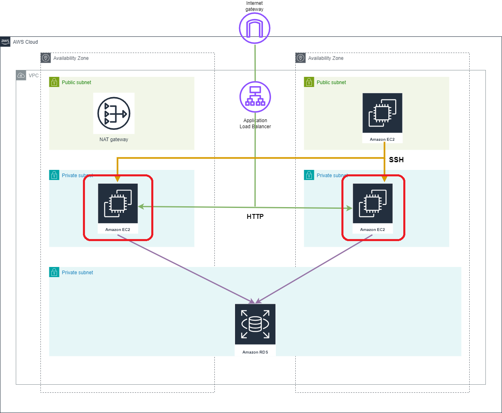

# Amazon Elastic Compute Cloud (EC2)

## Resources used in this module

### EC2 instance

Amazon Elastic Compute Cloud (Amazon EC2) is a web service that provides secure, resizable compute capacity in the cloud. Private EC2 instances are placed in private subnets and host production applications.

### Security group

Provides a security group resource for EC2 insatnce.

## Inputs required for this module to start

- env - Environment name
- instance_type - EC2 instance type
- private_subnet_ids - IDs of private subnets
- vpc_id - Id of VPC
- instance_keypair - AWS EC2 Key pair that need to be associated with EC2 Instance

## Outputs generated after building all resources

- ec2_private_instance_ids - List of IDs of instances
- ec2_private_ip - List of private IP addresses assigned to the instances
- ec2_private_sg_ids -EC2 private sg ids