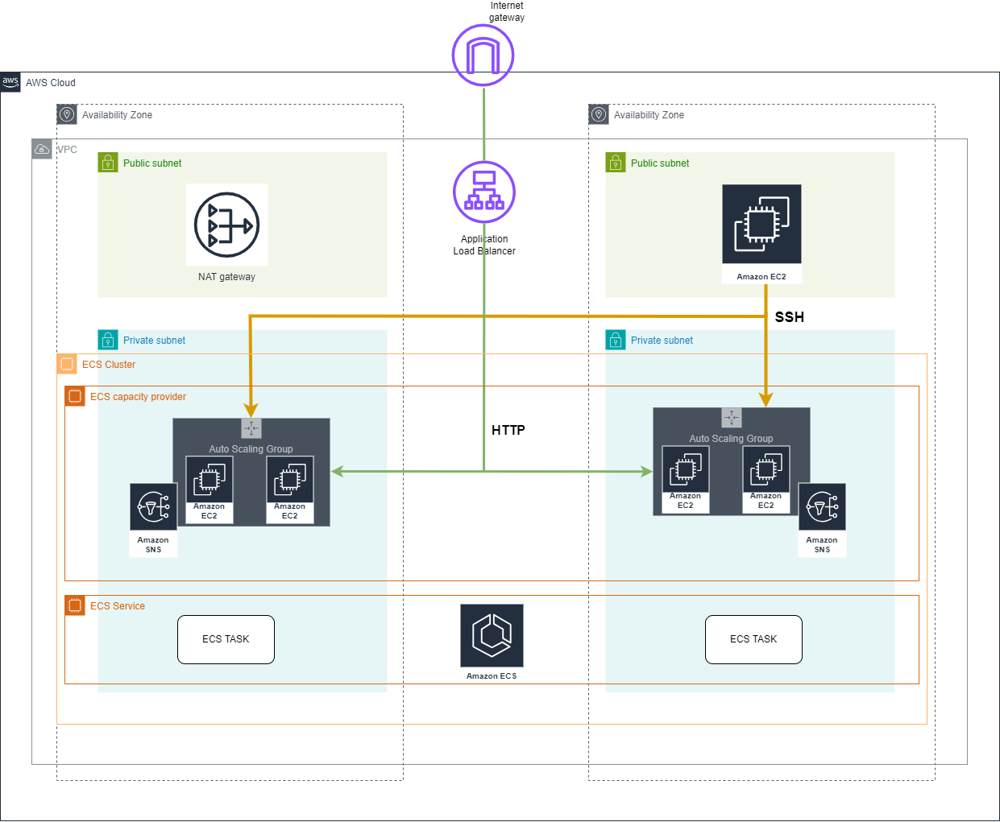

# Amazon Elastic Container Service module (ECS)

## Resources used in this module

### ECS Cluster 

An Amazon ECS cluster is a logical grouping of tasks or services. In addition to tasks and services, a cluster consists of the following resources:

- The infrastructure capacity which can be a combination of the following:
- Amazon EC2 instances in the AWS cloud
- Serverless (AWS Fargate (Fargate)) in the AWS cloud
- On-premises virtual machines (VM) or servers

### ECS Capacity Provider

A capacity provider defines the cluster capacity that Amazon ECS scales up and down of the infrastructure you specify. You must first associate the capacity provider with a cluster before you use the capacity provider.

For AWS Fargate, the capacity providers are a FARGATE and a FARGATE_SPOT capacity provider which AWS creates. You associate the capacity provider with your cluster, and then add them to a capacity provider strategy.

For Amazon ECS on Amazon EC2 users, a capacity provider consists of a capacity provider name, an Auto Scaling group. A capacity provider also consists of all of the settings for managed scaling and managed termination protection. When you turn on managed scaling, Amazon ECS scales Auto Scaling groups in and out on your behalf.

### ECS Service

You can use an Amazon ECS service to run and maintain a specified number of instances of a task definition simultaneously in an Amazon ECS cluster. If one of your tasks fails or stops, the Amazon ECS service scheduler launches another instance of your task definition to replace it. This helps maintain your desired number of tasks in the service.

## Inputs required for this module to start

- env - Environment name
- autoscaling_group_arn - Autoscaling Group ARN
- aws_ecs_service_desired_count - Desired count for aws ecs service
- private_subnet_ids - IDs of private subnets
- security_groups_ids - List of private security groups ids
- alb_target_group_arn - ALB target group arn
- container_name - Name of container
- autoscaling_group_arn - Autoscaling Group ARN
- maximum_scaling_step_size -  Maximum scaling step size
- minimum_scaling_step_size - Minimum scaling step size
- target_capacity - Target capacity

## Outputs generated after building all resources

- cluster_id - The ID of the created ECS cluster
- cluster_name - The name of the created ECS cluster
- cluster_arn - The ARN of the created ECS cluster