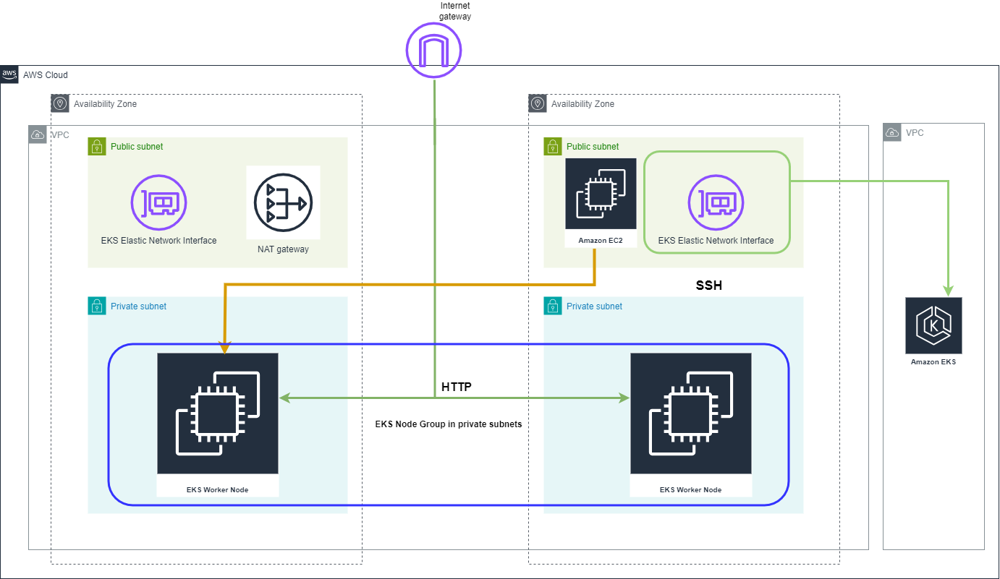

# Amazon Elastic Kubernetes Service module (EKS)

## Resources used in this module

### EKS Cluster 

An Amazon EKS cluster consists of two primary components:

- The Amazon EKS control plane
- Amazon EKS nodes that are registered with the control plane

The Amazon EKS control plane consists of control plane nodes that run the Kubernetes software, such as etcd and the Kubernetes API server. The control plane runs in an account managed by AWS, and the Kubernetes API is exposed via the Amazon EKS endpoint associated with your cluster. Each Amazon EKS cluster control plane is single-tenant and unique, and runs on its own set of Amazon EC2 instances.

### EKS Node group

Amazon EKS managed node groups automate the provisioning and lifecycle management of nodes (Amazon EC2 instances) for Amazon EKS Kubernetes clusters.

With Amazon EKS managed node groups, you don't need to separately provision or register the Amazon EC2 instances that provide compute capacity to run your Kubernetes applications. You can create, automatically update, or terminate nodes for your cluster with a single operation. Node updates and terminations automatically drain nodes to ensure that your applications stay available.

## Inputs required for this module to start

- cluster_name - Name of the EKS cluster. Also used as a prefix in names of related resources
- cluster_service_ipv4_cidr - Service ipv4 cidr for the kubernetes cluster
- cluster_version - Kubernetes minor version to use for the EKS cluster
- cluster_endpoint_private_access - Indicates whether or not the Amazon EKS private API server endpoint is enabled
- cluster_endpoint_public_access - Indicates whether or not the Amazon EKS public API server endpoint is enabled.
- cluster_endpoint_public_access_cidrs - List of CIDR blocks which can access the Amazon EKS public API server endpoint
- env - Environment name
- instance_type - EC2 instance type
- eks_keypair - AWS Key pair that need to be associated with EKS
- ami_type - Type of AMI which is used by eks cluster
- public_subnet_ids - Public subnets ids
- private_subnet_ids - Private subnets ids

## Outputs generated after building all resources

- cluster_id - The name/id of the EKS cluster
- cluster_arn - The Amazon Resource Name (ARN) of the cluster
- cluster_certificate_authority_data - Nested attribute containing certificate-authority-data for your cluster.
- cluster_endpoint - The endpoint for your EKS Kubernetes API
- cluster_version - The Kubernetes server version for the EKS cluster
- cluster_iam_role_name - IAM role name of the EKS cluster
- cluster_iam_role_arn - IAM role ARN of the EKS cluster
- cluster_oidc_issuer_url - The URL on the EKS cluster OIDC Issuer
- cluster_primary_security_group_id - The cluster primary security group ID created by the EKS cluster on 1.14 or later
- node_group_public_id - Public Node Group ID
- node_group_public_arn - Public Node Group ARN
- node_group_public_status - Public Node Group status
- node_group_public_version - Public Node Group Kubernetes Version
- node_group_private_id - Node Group 1 ID
- node_group_private_arn - Private Node Group ARN
- node_group_private_status - Private Node Group status
- node_group_private_version - Private Node Group Kubernetes Version