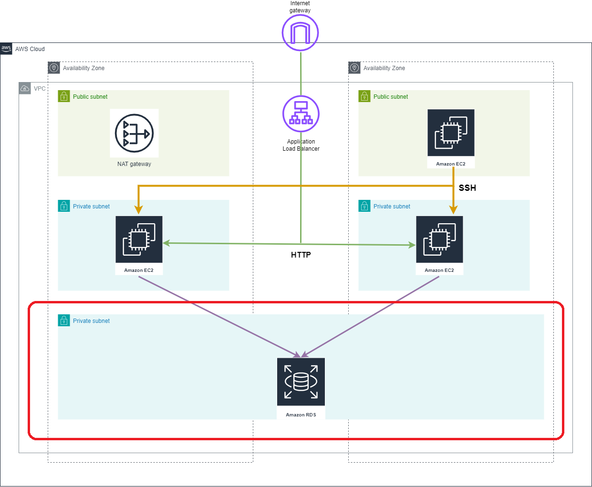

# Amazon Relational Database Service module (RDS)

## Resources used in this module

### RDS database 

A DB instance is an isolated database environment in the cloud. A DB instance can contain multiple user-created databases.

### RDS parameter group

Provides an RDS DB parameter group resource. Documentation of the available parameters for various RDS engines can be found at:

- [Aurora MySQL Parameters](https://docs.aws.amazon.com/AmazonRDS/latest/AuroraUserGuide/AuroraMySQL.Reference.html)
- [Aurora PostgreSQL Parameters](https://docs.aws.amazon.com/AmazonRDS/latest/AuroraUserGuide/AuroraPostgreSQL.Reference.html)
- [MariaDB Parameters](https://docs.aws.amazon.com/AmazonRDS/latest/UserGuide/Appendix.MariaDB.Parameters.html)
- [Oracle Parameters](https://docs.aws.amazon.com/AmazonRDS/latest/UserGuide/Overview.DBInstance.Modifying.html#USER_ModifyInstance.Oracle.sqlnet)
- [PostgreSQL Parameters](https://docs.aws.amazon.com/AmazonRDS/latest/UserGuide/Appendix.PostgreSQL.CommonDBATasks.html#Appendix.PostgreSQL.CommonDBATasks.Parameters)

### RDS security group

Provides a security group resource for RDS database.

### RDS subnet group

Provides an RDS DB subnet group resource.

## Inputs required for this module to start

- db_name - AWS RDS Database Name
- db_username - AWS RDS Database Administrator Username
- db_password - AWS RDS Database Administrator Password
- instance_class - Instance type for running rds instance
- subnet_group_name - RDS subnet group name
- private_subnet_ids - IDs of private subnets
- env - Environment name
- vpc_id - Id of VPC
- parameter_group_name Name of parameter group

## Outputs generated after building all resources

- db_instance_address - The address of the RDS instance
- db_instance_arn - The ARN of the RDS instance
- db_instance_availability_zone - The availability zone of the RDS instance
- db_instance_endpoint - The connection endpoint
- db_instance_engine - The database engine
- db_instance_engine_version_actual - The running version of the database
- db_instance_hosted_zone_id - The canonical hosted zone ID of the DB instance (to be used in a Route 53 Alias record)
- db_instance_identifier - The RDS instance identifier
- db_instance_resource_id - The RDS Resource ID of this instance
- db_instance_status - The RDS instance status
- db_instance_name - The database name
- db_instance_username - The master username for the database
- db_instance_port - The database port
- db_subnet_group_id - The db subnet group name
- db_subnet_group_arn - The ARN of the db subnet group"
