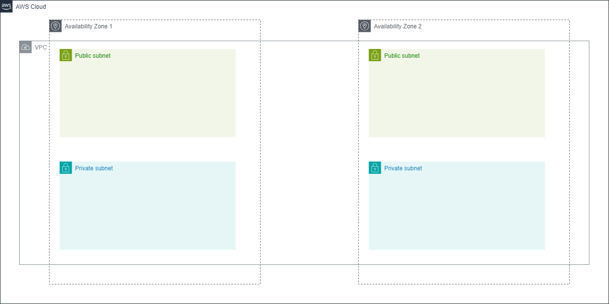

# Virtual Private Cloud module (VPC)

## Resources used in this module

### VPC 

A VPC is a virtual network that closely resembles a traditional network that you'd operate in your own data center. After you create a VPC, you can add subnets.

### NAT Gateway

A NAT gateway is a Network Address Translation (NAT) service. You can use a NAT gateway so that instances in a private subnet can connect to services outside your VPC but external services cannot initiate a connection with those instances.

### Internet Gateway

An internet gateway is a horizontally scaled, redundant, and highly available VPC component that allows communication between your VPC and the internet. It supports IPv4 and IPv6 traffic. It does not cause availability risks or bandwidth constraints on your network traffic.

### Route Tables

A route table contains a set of rules, called routes, that determine where network traffic from your subnet or gateway is directed.

### VPC subnets

A subnet is a range of IP addresses in your VPC. You can create AWS resources, such as EC2 instances, in specific subnets.

## Inputs required for this module to start

- env - Environment name
- vpc_cidr_block - CIDR (Classless Inter-Domain Routing)
- azs - Availability zones for subnets
- private_subnets - CIDR ranges for private subnets
- public_subnets - CIDR ranges for public subnets
- private_subnet_tags - Private subnet tags
- public_subnet_tags - Public subnet tags
- vpc_id - Id of VPC
- parameter_group_name Name of parameter group

## Outputs generated after building all resources

- vpc_id - The address of the RDS instance
- private_subnet_ids - The ids of private subnets
- public_subnet_ids - The ids of public subnets
